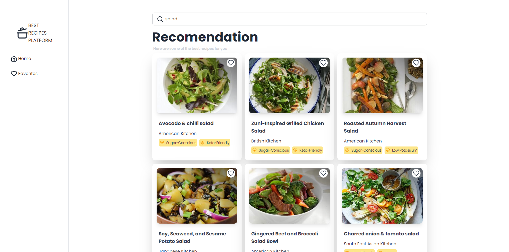

# Recipe Finder

Recipe Finder is a responsive React application that allows users to search for recipes using an API, view detailed information about each recipe, and save their favorite recipes. The application is designed to be fully responsive, ensuring a seamless user experience on different devices, from desktops to mobile phones.



## Features

- Responsive Design: Optimized for different screen sizes and devices.
- Search Functionality: Search for recipes by keywords.
- Recipe Details: View detailed information about each recipe.
- Favorites Management: Save and manage your favorite recipes.
- Easy Navigation: Smooth navigation between different pages.

## Installation

Clone the repository:

```
git clone https://github.com/ixedasan/react-recipes.git
```

Navigate to the project directory:

```
cd react-recipes
```

Install the dependencies:

```
npm install
```

## API Configuration

To use the Recipe Finder application, you need to configure your API credentials. Obtain your API ID and API Key from the Edamam API and add them to the project.

**Setup .env file**

```
VITE_APP_ID = your_edamam_app_id;
VITE_APP_KEY = your_edamam_app_key;
```

## Usage
Start the development server:
```
npm run dev
```

## Contributing

Contributions are welcome! Please open an issue or submit a pull request for any improvements or bug fixes.